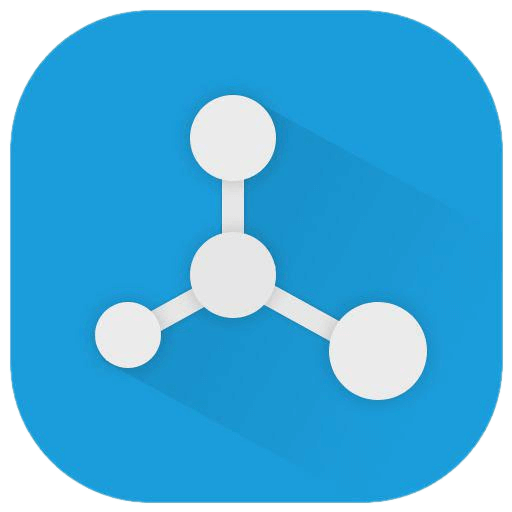

<div style="text-align: center; margin: 40px 0px">
  </img>
</div>

# NoMoTS Web App

<!-- MarkdownTOC depth=3 autolink=true bracket=round -->

- [Description](#description)
- [Dependencies](#dependencies)
- [Build](#build)
    - [Serve](#serve)
    - [Develop](#develop)
    - [Deploy](#deploy)

<!-- /MarkdownTOC -->

## Description

NoMoTS Web App serves as an example front-end to easily interact with a deployed instance of the demo API included in [NoMoTS API](https://github.com/maninak/NoMoTS-api) boilerplate.

Built with Ionic which is an Angular framework, it features native look'n'feel tailored to the visitor's device (iOS, Android, Windows Phone). Since it's built as a Progressive Web App, it can be soft installed on device with the "Add to Desktop" action and even launched when offline.

## Dependencies

If Ionic is not already installed in your machine, run:

```sh
$ sudo npm install -g ionic
```

## Build

```sh
$ git clone git@github.com:maninak/NoMoTS-webapp.git && \
  cd NoMoTS-webapp && \
  npm install
```

### Serve
This will serve the application in a browser. Any source code edits automatically trigger rebuild and refresh the browser.

```sh
$ ionic serve
```
### Deploy

First run the following command to make a production build for the web:

```sh
$ npm run build:www
```

Then the contents of the folder `www` are ready to be served.